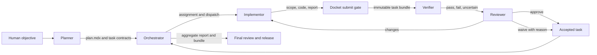
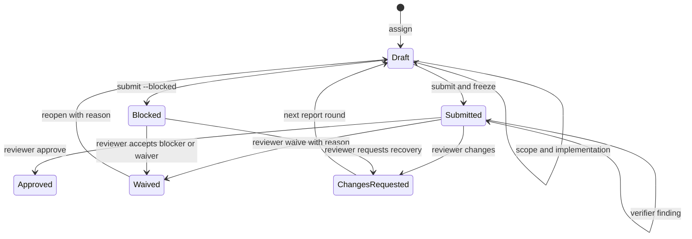
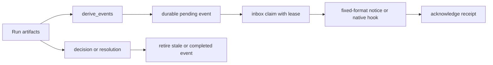

# Current Docket system guide

This document explains how the current Docket implementation works so a human reviewer can identify improvements.
It describes the implemented system and the operating contracts.
It is not a replacement for the executable CLI or its tests.

For improvement requirements in this repository, [`improvements/workflow-improvement-plan.md`](../improvements/workflow-improvement-plan.md) is the declared source of truth.
For current behavior, [`skills/docket/bin/docket`](../skills/docket/bin/docket) and [`skills/docket/tests/test_docket.py`](../skills/docket/tests/test_docket.py) are the executable truth.
[`ARCHITECTURE.md`](../ARCHITECTURE.md) explains the mechanics and invariants, while [`skills/docket/SKILL.md`](../skills/docket/SKILL.md) and the role references define how agents operate the system.

## 1. Mental model

Docket is a file protocol plus a stdlib-only CLI for coordinating coding work across agent harnesses.
Claude Code, Codex, and OpenCode do not need a shared messaging API because they read and write the same run directory.

The logical roles are:

1. Planner: owns intent, constraints, acceptance, risks, and amendments.
2. Orchestrator: owns assignment, dispatch, sequencing, recovery, routing, and aggregation.
3. Implementor: owns repository discovery, scope, implementation, verification execution, and the task report.
4. Verifier: challenges whether frozen evidence proves the acceptance criteria.
5. Reviewer: independently approves, waives, or requests changes.

Five logical roles do not require five processes.
Topology controls which roles share an agent, while workflow policy controls which authorities the CLI enforces.



The submitted report, the baseline-relative patch, the captured verification, and the frozen bundle are review evidence.
Chat, terminal scrollback, agent lifecycle labels, scope capsules, and partial handoffs are context, not completion evidence.

## 2. Configuration dimensions

The word "mode" is overloaded in normal discussion.
Docket has several independent configuration dimensions.

| Dimension | Values | What it changes |
| --- | --- | --- |
| Topology | `split`, `combined` | Whether planner and orchestrator are separate agents |
| Workflow policy | `legacy`, `five-role-v1` | Which role authorities, verification artifacts, routing, and correction budgets are enforced |
| Evidence mode | `git`, `documents-only` | Whether Docket must reconstruct and freeze repository diffs |
| Harness | `claude`, `codex`, `opencode` | Which agent interface is recorded for a task |
| Integration policy | `forbidden`, `allowed` | Whether verified but unapproved bundles may be consumed provisionally |
| Executor | `implementor`, `orchestrator` | Who performs an assigned task |
| Complexity | `low`, `high` | Expected model strength and review depth; independent of executor |
| Delivery | native hook, qualified service, manual queue | How an idle role learns an actionable event exists |
| Prompt arm | `current`, `contract`, `contract-cards` | Experimental implementor treatment; not a normal workflow mode |

An ordinary full run might therefore be:

```text
topology: split
workflow: five-role-v1
evidence_mode: git
provisional_integration: forbidden
planner harness: claude
implementor harness: opencode
delivery: native Claude hook for waiting roles, manual elsewhere
```

### 2.1 Split topology

Planner and orchestrator are separate agents.
This protects the planner's context and premium-token budget.

The planner writes and approves the functional plan, then stops supervising task work.
It does not monitor implementors, read task reports, receive task-level wakes, or relay routine progress.
Its next implementation artifact is the orchestrator's aggregate report.

Use split topology when intent and final judgment need a capable model but execution and supervision can use cheaper models.

```bash
docket init R01 --topology split --harness claude
```

### 2.2 Combined topology

One agent performs planner and orchestrator duties.
Implementors may still be separate.

The run keeps the same files, submission gate, bundles, and aggregate report.
The combined agent does not hand the final aggregate back to itself through a redundant wake.

Use combined topology for smaller work, one-agent operation, or when the cost boundary is less valuable than simplicity.

```bash
docket init R01 --topology combined --harness claude
```

### 2.3 Legacy workflow

`workflow: legacy` preserves the original lifecycle for old runs.
It does not retroactively impose the five-role authority model.

Legacy runs are not silently upgraded.
Migration is explicit and records the old and new workflow versions.

```bash
docket migrate R01 --to five-role-v1
```

An interrupted migration resumes rather than rewriting prior artifacts.

### 2.4 Five-role workflow

`workflow: five-role-v1` requires role identity on lifecycle mutations and separates verification from approval.

Key properties:

- Implementors submit task work.
- Verifiers record `pass`, `fail`, or `uncertain` findings, but never approve.
- Reviewers alone approve or waive.
- Planners own requirement and contract amendments.
- Orchestrators route and assemble, but do not waive or approve disputed work.
- Local verifier and reviewer correction rounds share one budget.
- Budget exhaustion creates one durable escalation and never grants a verdict.

```bash
docket init R01 --workflow five-role-v1
```

### 2.5 Git evidence mode

`evidence_mode: git` requires complete, reconstructable repository evidence.

Every checkout root is declared explicitly as `alias=path` before dispatch.
Only declared roots are captured.
Nested repositories, linked worktrees, and sibling checkouts are never discovered implicitly.

```bash
docket init R01 --evidence-mode git \
  --root app=/work/app \
  --root library=/work/library
```

The declaration becomes immutable once a baseline exists.
If a required root was omitted, the run cannot quietly add it later because that would change what existing baselines mean.

A Git baseline includes enough local evidence to reconstruct committed, staged, unstaged, untracked, deleted, renamed, binary, and symlink changes without committing or stashing the user's work.
Oversized or unreadable content refuses capture rather than producing partial evidence.

### 2.6 Documents-only evidence mode

`evidence_mode: documents-only` keeps the lifecycle, reports, verification capture, decisions, and immutable bundles, but records patch coverage as unavailable.

It never presents missing Git evidence as an empty diff.
This mode is useful outside a Git checkout or when a milestone cannot safely capture repository state.

```bash
docket init R01 --evidence-mode documents-only
```

### 2.7 Provisional integration

The default policy is:

```text
provisional_integration: forbidden
```

With `forbidden`, a task may consume another task only after approval.

With `allowed`, a task may consume a specific frozen bundle before approval only when that bundle has passing frozen verification.
Blocked, skipped, failed, stale, damaged, and patchless bundles remain unusable.

The consumer records the exact bundle:

```bash
docket depend R01 T04 --on T03
```

If T03 publishes a different bundle, T04 becomes stale.
Refreshing the pin is not reverification.
T04 needs a fresh round, a new dependency record, and another submission.

## 3. Role authority and information boundaries

| Role | Owns | Cannot do |
| --- | --- | --- |
| Planner | Objective, constraints, acceptance, risks, amendments, final outcome review in split mode | Implement tasks or supervise task-level activity |
| Orchestrator | Assignments, batches, dispatch, dependency ordering, recovery, routing, aggregate report | Alter acceptance, waive requirements, approve disputed work |
| Implementor | Discovery, scope proposal, code, task verification, evidence report, handoff | Approve itself, edit submitted evidence, bypass scope ownership |
| Verifier | Independent evidence challenge and numbered findings | Approve, waive, change requirements, invent implementation fixes |
| Reviewer | Correctness and design judgment, approval, waiver, requested changes | Treat verifier pass as automatic approval |

Authority is exclusive rather than cumulative.
A deterministic test command is infrastructure and cannot impersonate verifier or reviewer judgment.

Under `five-role-v1`, commands use `--as` to enforce the acting role.

```bash
docket submit R01 T03 --as implementor
docket verify R01 T03 --result pass --as verifier
docket decide R01 T03 --approve --as reviewer
```

## 4. Run creation and planning

`docket init` creates `.docket/runs/<run>/plan.mdx`.
The default plan is flat frontmatter plus prose sections.
Docket intentionally implements a small `key: value` parser rather than general YAML.

Default policy fields include:

```text
status: draft
topology: split|combined
progress_updates: quiet
evidence_mode: git|documents-only
provisional_integration: forbidden
workflow: legacy|five-role-v1
correction_limit: 2
verifier_correction: forbidden
```

Optional flat policy fields include:

```text
primary_model: provider/model
fallback_models: provider/model-a,provider/model-b
max_concurrency: 2
stall_grace_seconds: <seconds>
```

The planner defines functional intent and observable acceptance.
It may provide hints, but it does not write a mandatory repository map for the implementor.
Repository discovery belongs to the implementor because that is where cheap context can be spent.

## 5. Assignment, discovery, and scope ownership

The orchestrator creates all assignments in the current batch before dispatching any of them.
This lets collision and readiness logic see the complete batch membership.

```bash
docket assign R01 T03 \
  --complexity low \
  --executor implementor \
  --harness opencode \
  --model provider/model \
  --effort high \
  --verify 'tests/test.sh'
```

Assignment creates the task contract, the first report draft, and the task baseline.
A Git run that cannot capture its full baseline refuses the assignment before work begins.

The implementor then discovers the repository and fills `T03-scope.mdx` with:

- Proposed paths.
- Relevant symbols or components.
- Exact verification command.
- Discovery reasoning.
- Any additional root-qualified paths.

```bash
docket scope R01 T03 --submit
```

A disjoint scope is accepted without an orchestrator approval turn.
A collision becomes an orchestrator event.
If later discovery expands the change surface, the implementor amends and resubmits the scope capsule before editing the new path.

Accepted scope stays owned until the review boundary.
It is not released merely because the implementation appears finished.

## 6. Dispatch, sessions, models, and recovery

`dispatch` binds one task round to one registered session.
It checks dependencies, scope ownership, session registration, model policy, and concurrency before creating the dispatch record.

```bash
docket session R01 --register \
  --session SESSION_ID \
  --name impl-a \
  --role implementor

docket dispatch R01 T03 \
  --session SESSION_ID \
  --agent impl-a \
  --model provider/model
```

Dispatch is exactly-once at the protocol level.
Repeating the same dispatch converges, while a second writer or mismatched session is refused.

Requested model flags are metadata, not proof of the live model.
The active model must be checked in the harness and recorded separately:

```bash
docket set-model R01 T03 --actual provider/model --effort high
```

When a session is interrupted, the implementor should freeze a semantic checkpoint:

```bash
docket handoff R01 T03
# Fill the generated handoff.
docket handoff R01 T03 --submit
```

The handoff records completed work, remaining work, verification, decisions, risks, and one exact next action.
It is continuity evidence, not completion evidence.

Recovery uses:

```bash
docket resume R01 T03 --session NEW_SESSION --reason 'provider exited'
docket switch-model R01 T03 --model approved/fallback --session NEW_SESSION
```

Fallbacks must stay within the approved flat model policy.
An initial dispatch outside the approved list is refused through the same open exception as a fallback switch, so policy cannot be bypassed by a new dispatch.
Absent means no primary and no fallbacks: any model dispatches with one plain line stating the run has no approved model policy so nothing is being enforced.
A primary with an empty fallback list means exactly one approved model.
Going beyond policy creates one explicit spending exception rather than a silent upgrade.
Each dispatch record binds the rendered prompt bytes as a prompt digest recomputable from docket prompt output for the same role and model.
Docket records bindings and never launches models: a new record reads unobserved until docket set-model verifies the live harness, and dispatch output says it recorded a binding rather than that it started anything.

## 7. Task lifecycle

Only Docket commands change report lifecycle state.
Agents must not hand-edit `status:`.



Round numbers are per owner.
`T03-report-02.mdx` and `T03-decision-02.mdx` are round 2 of T03 regardless of other task rounds.

### 7.1 Honest blocked work

Blocked submission is a designed success path for incomplete work that needs a decision or capability.
It is intentionally lighter than normal completion.

```bash
docket submit R01 T03 --blocked --as implementor
```

A blocked report must explain the exact decision or capability needed.
It skips completion verification and full evidence-table enforcement, but still freezes enough evidence to make the block reviewable and recoverable.

### 7.2 Corrections

A changes decision opens the next report round.
The previous report, decision, bundle, and verification remain immutable.

Verifier-triggered corrections require:

```text
verifier_correction: allowed
```

Reviewer and verifier corrections share `correction_limit`, which defaults to 2.
Exhaustion creates a durable escalation and refuses another local round.

### 7.3 Reopen

A waived task may be reopened with an explicit reason.

```bash
docket decide R01 T03 --reopen --reason 'new evidence invalidates waiver'
```

Reopen preserves every prior artifact, opens exactly one new round, increments batch generations where needed, and invalidates aggregates that pinned the old result.
An interrupted reopen resumes from its journal rather than opening another round.

## 8. The submit gate

`docket submit` is the load-bearing transition from an editable draft to immutable review evidence.

The gate checks, in broad order:

1. Correct run, owner, round, workflow role, and report state.
2. Required report sections and task acceptance copied faithfully.
3. Accepted scope exists and still matches the report's change list.
4. Current changes stay within the claimed scope.
5. Declared checkout roots and task baseline remain readable.
6. Dependencies are usable and match the inputs this round consumed.
7. Optional structured evidence rows are complete and mechanically consistent.
8. Git diff coverage is complete in `git` mode, or explicitly unavailable in `documents-only` mode.
9. The registered verification command runs last.
10. Task, report, scope, roots, source, and consumed inputs are rechecked after verification.
11. The exact captured bytes are frozen into a content-addressed bundle.
12. The report state moves to `submitted` or `blocked` and a durable event is derived.

One owner lock covers verification, freezing, ledger publication, and the report transition.
A concurrent edit leaves the edit in place but refuses the submission.
Docket never republishes a report body read before verification after discovering that the body moved.

`--skip-verify` is for a genuinely broken verification command and requires an audit reason.
It is not a convenience for hurried work.

## 9. Baselines, diffs, and frozen bundles

### 9.1 Baseline layers

A Git run records:

- A run baseline before the first implementor edit.
- A task baseline at assignment.
- The accepted task scope.
- Captured staged, unstaged, and untracked content needed for reconstruction.
- Git tree identities rebuilt through a private index and object store.

Reconstruction never writes to the measured checkout, its index, refs, or primary object store.
Private Git indexes and objects live under the run.

### 9.2 Task-round bundle

Each submitted round freezes:

- Task contract revision.
- Exact submitted report body.
- Accepted scope.
- Frozen consumed-input record, including the empty set.
- Task baseline and reconstruction material.
- Full root-qualified baseline-relative patch.
- Resulting source revision.
- Verification command, environment, outputs, counts, timestamps, and model identity status.
- Correction delta when this is a later round.
- A manifest with a digest for every artifact.

The bundle address is derived from its manifest.
Publishing identical content converges on the same address.
Different content cannot overwrite an existing address.

```bash
docket bundle R01 T03
docket diff R01 T03
```

Missing, changed, or unreconstructable evidence reports `DAMAGED` or stale.
It never degrades to an apparently intact empty patch.

### 9.3 Aggregate bundle

The orchestrator has the literal owner `orch`.
Its aggregate submission freezes:

- The orchestrator report.
- The run baseline.
- The aggregate patch.
- Integrated source revision.
- Captured integration verification.
- Exact constituent task bundle digests.

A moved, reopened, or damaged constituent makes the aggregate stale.

## 10. Verification and review

### 10.1 Mechanical verification

The task's `verify:` command runs under `/bin/sh` after structural checks.
Docket captures command, working directory, declared environment inputs, start and end time, exit status, stdout, stderr, parsed counts when supported, and source identity.

A verify command that writes non-ignored files into the checkout causes the freeze to fail because its result no longer describes the source being frozen.

### 10.2 Structured acceptance evidence

A task report may contain an `## Evidence` table with stable acceptance IDs such as A1 and A2.

Allowed states are:

- `met`
- `partial`
- `not-met`
- `not-verified`

A `met` row must name a frozen artifact or existing path and carry no gap.
The gate checks structure and references, but it does not keyword-police arbitrary prose.

### 10.3 Verifier findings

The verifier reads the task contract, submitted report, frozen bundle, captured verification, and the reusable verification obligations.

```bash
docket verify R01 T03 \
  --result pass|fail|uncertain \
  --detail 'numbered findings with evidence pointers' \
  --as verifier
```

Each attempt creates a new numbered verification artifact.
A pass means ready for review, not approved.

### 10.4 Reviewer decision

The reviewer works from a fresh context and a pinned packet.

```bash
docket review-packet R01 --role reviewer --out packet.mdx
docket decide R01 T03 --approve --as reviewer
docket decide R01 T03 --changes --as reviewer --reason 'numbered corrections'
docket decide R01 T03 --waive --as reviewer --reason 'explicit technical rationale'
```

The verdict binds the exact bundle digest and report-body digest.
If the report body changes after review, the decision is refused until `--re-review` puts the new body through the full gate and verification again.

Decision transitions are journaled and retry-safe.
Repeating the same bare verdict finishes an interrupted transition.
Changing the reviewer, reason, or verdict during the retry is refused.

## 11. Deterministic routing and amendments

`docket route --kind` maps exceptions to an authority rather than asking agents to negotiate ownership.

| Kind | Destination | Intended response |
| --- | --- | --- |
| `scope-change` | Implementor | Amend scope through the collision gate |
| `collision` | Orchestrator | Serialize or reassign overlapping work |
| `verification-defect` | Implementor | Correct findings and return to verifier |
| `rate-limit-crash` | Orchestrator | Resume or use an approved fallback |
| `requirement-conflict` | Planner | Propose a compact amendment |
| `dependency-invalidated` | Orchestrator | Adjust sequencing or escalate |
| `dependency-plan-change` | Planner | Replan only the affected branch |
| `dispute` | Reviewer | Preserve both claims and decide |
| `budget-exhausted` | Reviewer | Handle one durable escalation |
| `review-defect` | Implementor | Apply numbered corrections and reverify |
| `plan-gap` | Planner | Repair objective or contract through amendment |
| `waiver-request` | Reviewer | Decide the explicit waiver packet |
| `spending-request` | User | Budget owner decides outside-policy spend |

Amendments are compact proposals rather than informal chat edits:

```bash
docket propose-amendment R01 T03 \
  --need 'decision needed' \
  --conflicts 'conflicting constraints' \
  --evidence 'artifact pointers' \
  --alternative 'recommended change' \
  --impact 'acceptance and dependency effect'

docket amendment R01 --accept AMENDMENT_ID --by planner
```

Acceptance versions the contract and selectively invalidates affected evidence and events.
Unrelated work continues.

## 12. Events, signalling, inboxes, and delivery

Lifecycle state and delivery state are separate.
The source of truth is always the run artifacts from which events can be re-derived.



### 12.1 Native watcher

Claude Code can use a `Stop` hook with `asyncRewake: true`.
The hook runs `hooks/wake.sh`, which keeps `docket watch` in the hook's foreground process tree.

The watcher exits silently when nothing is actionable.
When something is actionable, it exits 2 with a fixed wake banner.

Rules:

- Never background the watcher with `&`, `nohup`, or `disown`.
- Arm every waiting role separately.
- Planner, orchestrator, verifier, and reviewer have separate ledgers.
- An unarmed role is never woken.

```bash
docket arm R01 --role planner
docket arm R01 --role orchestrator
docket arm R01 --role verifier
docket arm R01 --role reviewer
docket disarm R01
```

### 12.2 Durable delivery

`reconcile` builds durable pending records from current derived events and retires stale identities.
Inspection commands such as `status`, `doctor`, and `events --peek` never mutate delivery state.

```bash
docket reconcile R01
docket events R01 --role reviewer --peek
docket inbox R01 --role reviewer --claim --session SESSION_ID
docket events R01 --role reviewer --ack EVENT_ID --session SESSION_ID
docket events R01 --role reviewer --retry EVENT_ID --reason 'transport failed'
```

Claims use bounded leases.
Expired leases become claimable again.
Acknowledgement means receipt, not task completion.
Decisions and resolutions retire their events automatically.
Delivery is at-least-once, so duplicates must be harmless.

### 12.3 Session generations

A session registration includes workspace, run, role, session ID, name, and generation.
Re-registering after restart advances the generation.
Old generations cannot claim or acknowledge new events.

This prevents a reused pane or restarted session from inheriting a notice intended for a former occupant.

### 12.4 Qualified delivery and manual mode

Docket refuses to type into an uncertain active input buffer.

```bash
docket delivery R01 --role reviewer --pause
docket delivery R01 --role reviewer --queued
docket delivery R01 --role reviewer --resume
docket delivery R01 --role reviewer --probe
docket delivery R01 --role reviewer --send EVENT_ID --session SESSION_ID
docket delivery R01 --role reviewer --service-status
```

A transport is considered unattended only when a positive executable probe confirms a safe queue, send-if-idle, or turn-boundary capability.
Ambiguous help, negative wording, timeouts, unknown versions, and nonzero exits all produce manual mode.

In the current environment, Herdr 0.8.2 advertises no safe idle queue, so Docket reports manual delivery.
This does not affect the file protocol or explicit inbox pickup.

## 13. Batches and execution health

### 13.1 Explicit batches

```bash
docket batch R01 --create B1 --members T01,T02 --depends-on T02:T01 --milestone
docket batch R01 --close B1
docket batch R01 --list
```

Closing a batch freezes membership and dependency edges.
Readiness is computed only from closed membership and explicit dependencies.
Tasks created later cannot silently join a closed batch.

Milestone batches reserve capable-review wakes for meaningful boundaries.
Blockers, collisions, handoffs, and stall incidents remain immediate.

Reopen advances the generation of each affected batch so old readiness events cannot be reused.

### 13.2 Execution health

Report lifecycle and execution health answer different questions.

- `report=` describes draft, submitted, blocked, approved, waived, or changes requested.
- `execution=` describes running, idle-unsubmitted, awaiting-review, correction, done, stopped-recoverable, or unknown.

Quiet work is healthy by construction.
Docket does not infer a stall from elapsed time, an unchanged worktree, or rate-limit text.

```bash
docket health R01
docket health R01 --flag-stall T03 --cause 'worker stopped without handoff'
docket health R01 --resolve-stall T03-1
```

One explicit cause creates one durable incident and one recovery event until resolved or superseded by a generation change.

## 14. Deterministic prompts and the improvement cycle

`docket prompt` composes a role prompt from four ordered sources:

1. Short common role contract.
2. Task and decision contract.
3. Selected reviewed guidance.
4. Resume and evidence pointers.

The same inputs produce byte-identical output.
The prompt digest and selected profile revisions are recorded.

```bash
docket prompt R01 T03 --role implementor --model provider/model --max-tokens 600
```

Reviewed model and specialty cards live under [`skills/docket/references/model-profiles/`](../skills/docket/references/model-profiles/).
Unknown models receive the common contract only.
Provider, model, and effort remain execution metadata rather than persona text.

Feedback is optional evidence and never a gate:

```bash
docket feedback R01 --add \
  --role implementor \
  --category verification \
  --body 'Observed behavior, impact, and outcome'

docket feedback R01 --import-ops
docket retrospective R01
```

The cross-run improvement lifecycle is:

```text
observed -> proposed -> trial -> adopted
                         \-> rejected
```

No feedback item edits skills, prompts, gates, or policy automatically.
Adoption records an authorized change and its evaluation evidence.

## 15. Aggregate review, qualification, and final release

The final workflow has several distinct evidence layers.

### 15.1 Milestone and correction packets

```bash
docket review-packet R01 --role reviewer --out milestone.mdx
docket review-packet R01 --role reviewer --correction T03 --out correction.mdx
```

Packets include objective, task coverage, bundle and verification revisions, evidence deltas, acceptance states, verifier findings, waivers, incidents, escalations, amendments, integration evidence, and complete risks.

Correction packets also identify old and new bundle digests, the correction delta, refreshed verification, expanded scope, and addressed findings.

### 15.2 Suite qualification

```bash
docket suite R01 --qualify --command 'tests/test.sh' --timeout 2400
```

Suite qualification binds the exact command, working directory, timestamps, exit status, stdout, stderr, and source tree before and after execution.

The unittest parser requires exactly one complete terminal `Ran N tests` and `OK` or `FAILED` summary in exactly one stream.
The parsed verdict, failure count, and process exit must agree.

### 15.3 Delivery qualification

```bash
docket delivery R01 --role orchestrator --qualify --session SESSION_ID
```

Qualification exercises real announcement, kill and restart recovery, claim/send/ack/retry, generation reuse refusal, input-active refusal, and a disposable pane lifecycle when the capability exists.
Unsupported capabilities produce an honest blocked qualification rather than an unattended-delivery claim.

### 15.4 Frozen release

```bash
docket release R01 --freeze \
  --suite-artifact PATH \
  --milestone M4=DIGEST \
  --milestone M5=DIGEST
```

The release copies and pins:

- Aggregate and constituent bundles.
- Bundle manifests, reports, patches, baselines, verification output, filtered ledger, and private Git object store.
- Plan, task contracts, findings, decisions, incidents, escalations, and amendments.
- Suite and delivery qualification artifacts.
- Milestone digests or explicit unavailable entries.
- A complete inventory over paths, entry kinds, modes, link targets, and file bytes.

The release is staged, validated, and published by one atomic rename.
Final validation reads only the frozen release copy for bundle dependencies.

```bash
docket review-packet R01 --role reviewer --final --release DIGEST
docket metrics R01
```

`READY` means ready for independent review.
It never means approved.

## 17. Run directory map

```text
.docket/
  watch.conf
  templates/
  improvements/
  sessions/
  runs/<run>/
    plan.mdx
    <owner>-task.mdx
    <owner>-scope.mdx
    <owner>-handoff-NN.mdx
    <owner>-report-NN.mdx
    <owner>-verification-NN.mdx
    <owner>-decision-NN.mdx
    orch-report-NN.mdx
    docs/
    .snapshots/
      roots.json
      run.json
      <owner>.json
      <owner>/
    .baselines/
    .bundles/
      objects/
      work/
      <owner>/rounds.json
      <owner>/<round>/<digest>/
    .deps/
    .transitions/
    .locks/
    .dispatch/
    .delivery/
    .batches/
    .incidents/
    feedback/
    .amendments/
    .escalations/
    .suite/
    .release/
    .woke-<role>
```

`owner` is a task ID such as `T03` or the literal `orch`.
Session registrations and the cross-run improvement backlog live at the project-level `.docket/` root rather than inside one run.
Some directories appear only when the related feature is used.

## 18. Command families

| Area | Commands |
| --- | --- |
| Run setup | `init`, `roots`, `migrate`, `status`, `doctor` |
| Task definition | `assign`, `validate-task`, `scope`, `preflight` |
| Execution | `dispatch`, `resume`, `switch-model`, `set-model`, `handoff` |
| Submission and evidence | `submit`, `diff`, `bundle`, `depend` |
| Five-role judgment | `verify`, `decide`, `route`, `review-packet` |
| Contract changes | `propose-amendment`, `amendment` |
| Prompts and learning | `prompt`, `feedback`, `improvements`, `retrospective` |
| Events | `watch`, `events`, `inbox`, `reconcile`, `session`, `arm`, `disarm` |
| Operations | `batch`, `health`, `delivery` |
| Usage and release | `metrics`, `suite`, `release` |
| Documentation | `help planner`, `help orchestrator`, `help implementor`, `help verifier`, `help reviewer`, `help signalling` |

Use `docket <command> --help` for the current argument contract.

## 19. Source and reference map

| Source | Purpose |
| --- | --- |
| [`AGENTS.md`](../AGENTS.md) | Repository modification rules and invariants contributors must preserve |
| [`README.md`](../README.md) | Public user promises, installation, quick start, and basic commands |
| [`ARCHITECTURE.md`](../ARCHITECTURE.md) | Current data model, lifecycle, evidence mechanics, signalling, invariants, gaps, and code map |
| [`skills/docket/SKILL.md`](../skills/docket/SKILL.md) | Cross-harness skill entry point and compact operating contract |
| [`planner.md`](../skills/docket/references/planner.md) | Topology, evidence, integration policy, plan, and planner boundary |
| [`orchestrator.md`](../skills/docket/references/orchestrator.md) | Assignment, dispatch, quiet supervision, recovery, and aggregation |
| [`implementor.md`](../skills/docket/references/implementor.md) | Discovery, scope, implementation, evidence, blocked work, and handoff |
| [`verifier.md`](../skills/docket/references/verifier.md) | Independent evidence challenge and correction policy |
| [`reviewer.md`](../skills/docket/references/reviewer.md) | Fresh-context review, approval, waiver, and correction decisions |
| [`signalling.md`](../skills/docket/references/signalling.md) | Hook, watcher, inbox, lease, registration, and quiet-wait behavior |
| [`verification-obligations.md`](../skills/docket/references/verification-obligations.md) | Reusable adversarial verification principles |
| [`workflow-improvement-plan.md`](../improvements/workflow-improvement-plan.md) | Sole product requirements source for the improvement program |
| [`bin/docket`](../skills/docket/bin/docket) | Stdlib-only executable implementation |
| [`test_docket.py`](../skills/docket/tests/test_docket.py) | Behavioral regression suite |
| [`docket-architecture.html`](./docket-architecture.html) | Existing visual single-file architecture guide |

## 20. Current known gaps

The following are documented limits rather than accidental omissions:

- Interrupted atomic publication can leave a harmless temporary file that is not automatically swept.
- The run-private Git object store only grows and can contain local project data or secrets.
- Deleting the private object store damages bundles that depend on its trees.
- A verification command that writes non-ignored source files causes submission to fail.
- Checkout roots cannot be redeclared after a baseline exists.
- Oversized untracked files block Git evidence capture rather than producing incomplete evidence.
- `events --peek` is inspection only; direct watcher announcement does not claim an inbox lease.
- Delivery is at-least-once and wake events are not authenticated.
- Manual delivery remains necessary when no positively verified safe turn boundary exists.
- The three-round cap in the orchestrator playbook is advice; the configurable correction budget is the enforced mechanism.
- Scope submission does not yet sanity-check whether the first word of `verify:` resolves in `/bin/sh`.
- `docket status` truncates displayed verification commands.

See the full maintained list in [`ARCHITECTURE.md`](../ARCHITECTURE.md#known-gaps).

## 21. Invariants to preserve during improvements

1. Frontmatter is lifecycle truth; do not introduce a competing mutable state file.
2. Baselines are complete, immutable, and captured before measured work.
3. Missing evidence is unavailable or damaged, never silently empty.
4. Submitted reports are evidence and are never rewritten in place.
5. Verdicts bind exact bundle and report revisions.
6. Reverification is required after evidence or consumed inputs move.
7. Reconstruction never mutates the checkout being measured.
8. One owner submits at a time under one lock.
9. Frozen artifacts publish atomically and are content-addressed.
10. A verifier pass is readiness, never approval.
11. Reviewer and planner authority cannot be inferred from deterministic tools.
12. Blocking remains lighter than falsely claiming completion.
13. Inspection cannot consume or migrate delivery state.
14. Session, role, round, workflow, revision, and generation identity travel with events.
15. Quiet work is healthy until an explicit stall incident says otherwise.
16. Unknown delivery capability fails to manual mode.
17. Provider outages remain separate from model correctness failures.
18. Final packets render frozen evidence and still receive independent review.

## 22. Review worksheet

Use this section when recording proposed improvements.

### Product and role model

- Are five logical roles necessary for every run size?
- Are split and combined boundaries clear enough to users and agents?
- Is any role given responsibility without the information or authority it needs?
- Are correction and escalation rules proportional to task risk?

### Usability

- Which command sequences are too long for the value they provide?
- Which refusal messages do not name a precise recovery action?
- Which plan fields should be defaults, warnings, or hard gates?
- Which concepts need a higher-level command or guided workflow?

### Evidence and review

- Which evidence is essential to independent review?
- Which evidence is collected but rarely used?
- Are bundle and release sizes acceptable for real repositories?
- Can a reviewer reconstruct every claim without consulting mutable live state?

### Dispatch and recovery

- Does session registration match the real behavior of each harness?
- Are handoffs sufficient after provider exits and context loss?
- Can a resumed agent identify one exact next action without chat history?
- Are model fallback and spending decisions visible and auditable?

### Signalling and delivery

- Which harnesses have a trustworthy native turn-boundary mechanism?
- Is manual pickup clear when unattended delivery is unsupported?
- Are duplicate notifications harmless and distinguishable from normal receipts?
- Are event identities stable across corrections, reopen, migration, and batch generations?

### Maintenance

- Are README promises, architecture, skill instructions, playbooks, CLI help, and tests consistent?
- Can the installed copy drift from the repository copy?
- Are temporary, object-store, and release retention policies operationally acceptable?
- Which known gaps should become tested requirements in the next milestone?
